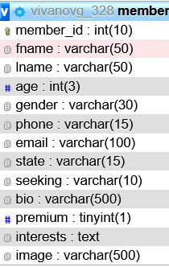

# 328-final

Project title: Terri Lynn Photography website
Authors: Adam Percival
         Timothy Fair
         Vladimir Ivanov

Implementation:
    1.MVC architectural pattern was implemented to separate business from logic.
    2. Implemented with fat-free framework templating language
    3. Model comprises The DataLayer class which facilitates database connections
    routines using PDO prepared statements to pass parameters and prevent SQL injections
    The Validator class manages the logic for the application through
    form validation, and redirects the data based on that validation.
    4. View handles the representation of data by routing URLs to render pages.
    5. Commit history could be found on the GitHub repository 
    6. Website utilizes OOP paradigm, the hierarchy is attached in the UML diagram
    7. Code is commented and documented according to PEAR standards
    8. user input is validated on the server as well as on the browser.
    9. Code repetitions are avoided and DRY principle is applied.
    10.Adequate effort was shown. 
    11. Google Maps API was used to embed map functionality

    ER: Diagram:

    UML diagram:

